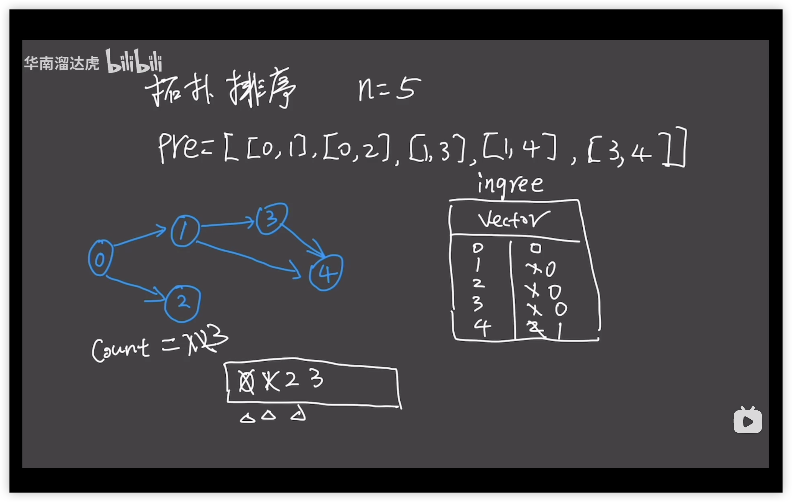

```md
你这个学期必须选修 numCourses 门课程，记为 0 到 numCourses - 1 。

在选修某些课程之前需要一些先修课程。 先修课程按数组 prerequisites 给出，其中 prerequisites[i] = [ai, bi] ，表示如果要学习课程 ai 则 必须 先学习课程 bi 。

例如，先修课程对 [0, 1] 表示：想要学习课程 0 ，你需要先完成课程 1 。
请你判断是否可能完成所有课程的学习？如果可以，返回 true ；否则，返回 false 。

示例 1：

输入：numCourses = 2, prerequisites = [[1,0]]
输出：true
解释：总共有 2 门课程。学习课程 1 之前，你需要完成课程 0 。这是可能的。
示例 2：

输入：numCourses = 2, prerequisites = [[1,0],[0,1]]
输出：false
解释：总共有 2 门课程。学习课程 1 之前，你需要先完成 ​ 课程 0 ；并且学习课程 0 之前，你还应先完成课程 1 。这是不可能的。

提示：

1 <= numCourses <= 2000
0 <= prerequisites.length <= 5000
prerequisites[i].length == 2
0 <= ai, bi < numCourses
prerequisites[i] 中的所有课程对 互不相同
```

> 拓扑排序：针对有向无环图的排序
> 入度： 所有指向该节点的边的个数
> 出度：该节点指向别的节点的个数
> 1，设计一个入度表，统计所有节点的入度
> 2，把入度为 0 的节点放入队列
> 3，访问队列的头部节点，把该节点的相邻节点的入度分别-1，再增加访问过的节点个数
> 4，把入度为 0 的节点继续放到队列里
> 5，再访问队列的头部节点，



```ts
function canFinish(numCourses: number, prerequisites: number[][]): boolean {
  // 考虑入度，后面要根据ingree的0的数目来进行count的增减，所以得初始化为0；
  let ingree = new Array(numCourses).fill(0);
  // 设置所有元素为空数组，二维的，得用form；
  let amap: number[][] = Array.from({ length: numCourses }, () => []);

  //   统计对应关系和入度
  for (let i = 0; i < prerequisites.length; i++) {
    // amap.set(prerequisites[i][0], prerequisites[i][1]);
    // 对于相同的元素，表示所有的关系
    amap[prerequisites[i][0]].push(prerequisites[i][1]);
    // 所有节点的入度
    ingree[prerequisites[i][1]]++;
  }

  //  入度为0的节点的队列
  let queue: number[] = [];
  //   访问过的节点
  let count: number = 0;
  for (let i = 0; i < numCourses; i++) {
    // 把所有入度为0的节点放入队列；
    if (ingree[i] === 0) {
      queue.push(i);
      // count++;
    }
  }

  // 遍历队列
  while (queue.length) {
    // 访问队首元素
    let cur = queue.shift() as number;
    count++;
    for (let i = 0; i < amap[cur].length; i++) {
      // 减少入度为0的节点的相邻节点的入度
      ingree[amap[cur][i]]--;
      // 如果入度为0，就push到队列中，同时增加访问的节点的数量
      if (ingree[amap[cur][i]] === 0) {
        queue.push(amap[cur][i]);
        // count++;
      }
    }
  }
  return count === numCourses;
}
```
